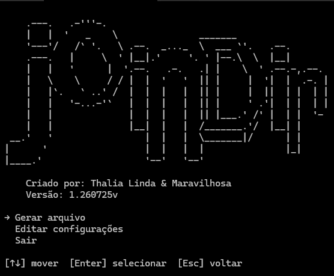

# joindir

## Versão 2.0

<p align="center">
  
</p>


Ferramenta de linha de comando para **juntar o conteúdo de vários arquivos de um projeto em um único texto**, pronto para colar no chat de uma LLM (ChatGPT, Claude, etc.) que não aceita upload de arquivos ou que tem limite de quantidade/tamanho de anexos.

A ideia é simples: você aponta uma (ou mais) pasta, o `joindir` varre tudo recursivamente, filtra o que não interessa (dependências, binários, arquivos de lock, pastas de build...) e monta um texto único onde cada arquivo aparece precedido pelo seu **caminho completo** — isso ajuda a LLM a enxergar a estrutura/árvore do projeto, não só o conteúdo solto. No final você escolhe copiar direto para a área de transferência ou salvar como `copia.txt`.

## Principais recursos

- **Seleção de pastas via janela do sistema** (usa o seletor nativo do Windows).
- **Varredura recursiva** com filtros configuráveis:
  - Extensões permitidas (`extensoes.txt`)
  - Pastas ignoradas (`ignorar_pastas.txt`) — ex: `node_modules`, `.git`, `venv`, `dist`...
  - Arquivos ignorados pelo nome exato (`ignorar_arquivos.txt`) — ex: `package-lock.json`
  - Finais de nome ignorados (`ignorar_finais.txt`) — ex: `.min.js`, `.log`, `-lock.json`
- **Suporte simplificado a `.gitignore`**: se a pasta escolhida tiver um `.gitignore` na raiz, os padrões dele também são aplicados (sem negações `!` e sem toda a especificação oficial, mas cobre o caso comum).
- **Interface no terminal (TUI)** para revisar a lista de arquivos encontrados antes de gerar o resultado:
  - Adicionar outra pasta à seleção
  - Remover arquivos individualmente da lista
  - Confirmar e gerar o resultado
- **Editor de configurações** direto pelo menu, sem precisar abrir os `.txt` na mão (embora também possa editá-los diretamente).
- **Saída final**: copiar para a área de transferência ou salvar em arquivo `.txt`, com um resumo de quantidade de arquivos, caracteres, tamanho em KB e estimativa de tokens.
- Lida com arquivos que não são UTF-8 (tenta `latin-1` como fallback) e avisa quais arquivos não puderam ser lidos.
- Aceita rodar já apontando para uma pasta específica, sem precisar escolher pelo diálogo.

## Formato da saída

Para cada arquivo incluído, o texto gerado segue este padrão:

```
C:\caminho\completo\do\arquivo.py

<conteúdo do arquivo>

C:\caminho\completo\de\outro\arquivo.js

<conteúdo do arquivo>
```

O caminho completo antes de cada bloco serve justamente para a LLM entender onde cada arquivo está na árvore do projeto, mesmo sem receber a estrutura de pastas de verdade.

## Instalação (Windows)

1. Tenha o Python 3 instalado (com o launcher `py`).
2. Baixe/clone esta pasta em qualquer lugar do seu computador.
3. (Opcional, recomendado) Rode `instalar_joindir_no_path.bat`. Ele detecta automaticamente a pasta onde está e adiciona ela ao **PATH do usuário** no Windows, sem precisar de caminho fixo digitado à mão. Depois disso, feche e abra um novo terminal.
4. Pronto: agora dá pra chamar o programa de qualquer lugar digitando apenas:
   ```
   joindir
   ```

Se preferir não mexer no PATH, dá pra rodar direto o `joindir.cmd` de dentro da pasta do projeto.

### O que o `joindir.cmd` faz

Ao ser executado, ele:
1. Verifica se as dependências (`pyperclip`, `prompt_toolkit`) já estão instaladas.
2. Se não estiverem, instala automaticamente via `pip install -r requirements.txt`.
3. Executa `main.py`, repassando qualquer argumento recebido (por exemplo, uma pasta).

## Como usar

Rodar sem argumentos abre o menu principal:

```
joindir
```

Menu principal:

- **Gerar arquivo** — abre o seletor de pasta, faz a varredura e mostra a lista de arquivos encontrados.
- **Editar configurações** — abre um editor de listas (extensões, pastas ignoradas, finais ignorados, arquivos ignorados).
- **Sair**

Também é possível já passar uma pasta como argumento para pular direto para a varredura:

```
joindir "C:\meus-projetos\app"
```

### Navegação na lista de arquivos

- `↑` / `↓` — mover o cursor
- `A` — adicionar outra pasta à seleção atual (útil para juntar arquivos de lugares diferentes em um único resultado)
- `Del` / `Backspace` — remover o arquivo selecionado da lista
- `Enter` — confirmar e ir para a etapa final
- `Esc` — cancelar

Na etapa final, escolha entre:

- **Copiar para a área de transferência** — cola direto no chat da LLM.
- **Salvar como `copia.txt`** — abre o diálogo para escolher onde salvar.
- **Cancelar**

## Configuração

Na primeira execução, o programa cria uma pasta `config/` ao lado do `main.py`, com os seguintes arquivos (se ainda não existirem):

| Arquivo | Para que serve |
|---|---|
| `extensoes.txt` | Extensões de arquivo que serão incluídas na varredura (ex: `.py`, `.js`, `.md`) |
| `ignorar_pastas.txt` | Nomes de pastas que devem ser ignoradas (ex: `node_modules`, `.git`, `dist`) |
| `ignorar_finais.txt` | Finais de nome de arquivo a ignorar (ex: `.min.js`, `.log`, `-lock.json`) |
| `ignorar_arquivos.txt` | Nomes exatos de arquivo a ignorar (ex: `package-lock.json`, `.DS_Store`) |

Esses arquivos podem ser editados de duas formas:
1. Pelo menu **Editar configurações** do próprio programa (interface no terminal com adicionar/editar/remover).
2. Editando os `.txt` diretamente em qualquer editor de texto — um item por linha.

As configurações incluídas por padrão neste repositório já cobrem os casos mais comuns de projetos web e Python (linguagens populares, arquivos de lock, pastas de dependências e build, etc.), servindo como ponto de partida.

## Requisitos

- Python 3
- Windows (os scripts `.bat`/`.cmd` e o seletor de janela do Tkinter são pensados para esse ambiente)
- Dependências Python (instaladas automaticamente pelo `joindir.cmd`):
  - `pyperclip`
  - `prompt_toolkit`

## Estrutura do projeto

```
joindir/
├── main.py                          # Lógica principal (varredura, TUI, geração do texto)
├── joindir.cmd                      # Atalho para rodar o programa (instala dependências se preciso)
├── instalar_joindir_no_path.bat     # Adiciona a pasta ao PATH do usuário no Windows
├── requirements.txt                 # Dependências Python
├── extensoes.txt                    # Config padrão: extensões incluídas
├── ignorar_pastas.txt               # Config padrão: pastas ignoradas
├── ignorar_finais.txt               # Config padrão: finais de arquivo ignorados
├── ignorar_arquivos.txt             # Config padrão: nomes de arquivo ignorados
└── config/                          # Criada automaticamente na primeira execução
```